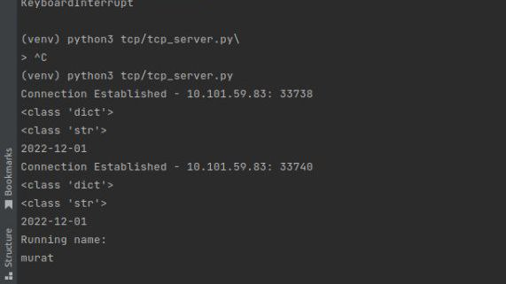

# Client-server(HTTP, TCP, TCL/SSL) on native-python 

# INTRODUCTION
Hello everyone, my name is Muratbek, i'm present my projects on native python. 

	So what is TCP, TCL, HTTP: 

The Hypertext Transfer Protocol (HTTP) is an application layer protocol in the Internet protocol suite model for distributed collaborative, hypermedia information systems.[1] HTTP is the foundation of data communication for the World Wide Web, where hypertext documents include hyperlinks to other resources that the user can easily access, for example by a mouse click or by tapping the screen in a web browser. 

 

TCP stands for Transmission Control Protocol a communications standard that enables application programs and computing devices to exchange messages over a network. It is designed to send packets across the internet and ensure the successful delivery of data and messages over networks. 

 

SSL (Secure Socket Layer) and TLS (Transport Layer Security) are popular cryptographic protocols that are used to imbue web communications with integrity, security, and resilience against unauthorized tampering. PKI uses the TLS protocol to establish secure connections between clients and servers over the internet, ensuring that the information relayed is encrypted and unable to be read by an external third party. 


## Documentation

1.Clone this repository to the local repository

```
    git clone https://github.com/muratbek2255/rest-service-on-native-python.git
```

2.Create venv:
    python3 -m venv env 
    source env/bin/activate

3.Pip install -r requirements.txt


4.Create 'env file', and create variable environment.

HOST=your_ip_or_host
PORT=your_port
Certfile=your_certfile_for_ssl //is for tls 
Keyfile=your_keyfile_for_ssl //is for tls

### Run

    HTTP:
        1.python3 https/http_server.py
        2.Open Dockerfile and change tlc / . and CMD on https / . and CMD['python3', '"./http_server.py']
    TCP:
        1.python3 tcp/tcp_server.py(we run server), then run client(python3 tcp/tcp_client.py) 
        2.Open Dockerfile and change tcp / . and CMD on https / . and CMD['python3', './tcp_server.py', './tcp_client.py']
    TCL:
        1.python3 tls/tls_server.py(we run server), then run client(python3 tls/tls_client.py) 
        2.Open Dockerfile and change tcp / . and CMD on https / . and CMD['python3', './tcp_server.py', './tcp_client.py']

#### Result
HTTP:
    
    (
    I'm check with postman:
    POST-methods
    {
      "name": "murat",
      "time": "00:13 02.12.22"
    }
    )

TCP:
    

    I'm create tcp/tcp_client.py then input data and send to server


TSL: 
    

    The same as in tsp, but you need to create a certfile and keyfile for ssl